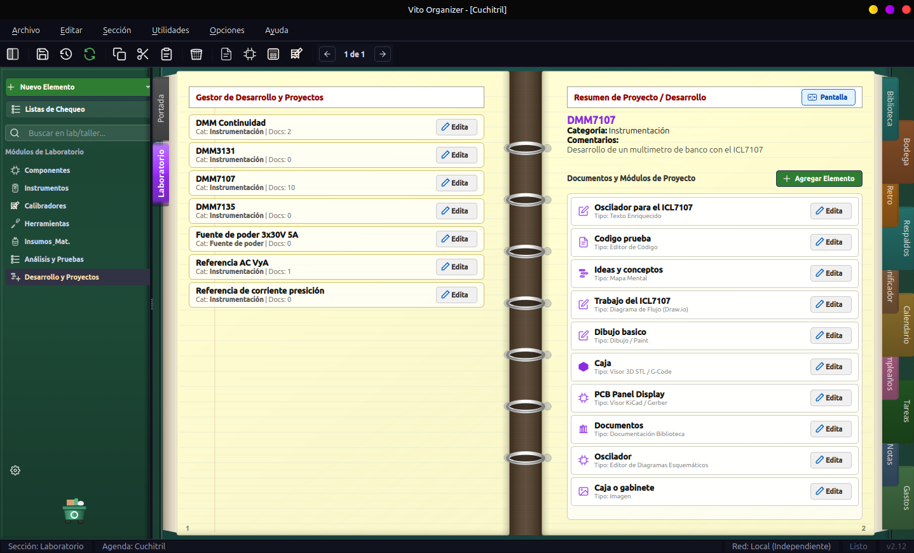
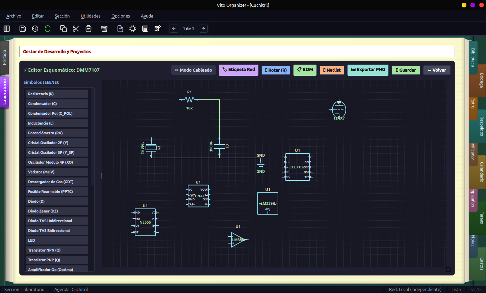
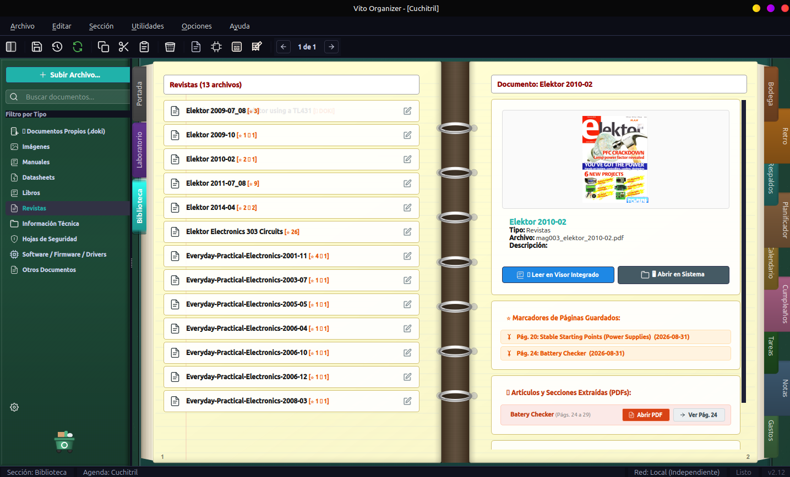

# 📖 Vito Organizer

<p align="center">
  <b>Una agenda personal esqueumórfica al estilo clásico de Lotus Organizer con implementaciones modernas.</b><br>
  <i>Desarrollado por <b>Vitokin</b> con especial dedicatoria para todos los entusiastas de la electrónica y el grupo de <b>Naser Electrónica</b>.</i>
</p>

<p align="center">
  
  
  
  
  
</p>

---

## 🌟 Acerca del Proyecto y Dedicatoria

**Vito Organizer** rescata la calidez, claridad y elegancia del mítico **Lotus Organizer**, combinando una estética esqueumórfica de libreta encuadernada en anillas con las herramientas de productividad y tecnología actuales.

> ❤️ **Dedicatoria Especial:** Este proyecto está dedicado con mucho aprecio a **todos los entusiastas de la electrónica** y a la gran comunidad de **Naser Electrónica**.

No es solo una agenda: integra un avanzado ecosistema para gestión personal, laboratorio de electrónica e instrumentación, visor documental con traducción técnica por IA y suite ofimática propia.

---

## 📸 Capturas de Pantalla

### 🔬 Laboratorio y Gestor de Desarrollo de Proyectos
Gestión integral de proyectos de electrónica e instrumentación, con documentos asociados, especificaciones, esquemas y notas técnicas.


### ⚡ Editor Esquemático de Circuitos Integrado
Diseño rápido de diagramas y esquemas electrónicos interactivos, rotación de componentes, asignación de netlists y exportación directa.


### 📚 Biblioteca Documental y Visor Integrado
Catálogo documental organizado por categorías (datasheets, manuales, revistas, libros) con previsualización, gestión de marcadores de página y extracción de artículos.


---

## ✨ Características Principales

### 📅 Agenda y Organización Personal
- **Portada interactiva:** Reloj analógico, calendario mensual, tareas del día, notas rápidas y resumen general.
- **Calendario multianual:** Vistas mensual, semanal y diaria con eventos, citas, categorías y alarmas.
- **Planificador / Diagrama de Gantt:** Cronograma panorámico para seguimiento visual de metas y proyectos.
- **Tareas y Listas de Pendientes:** Clasificación por estado, prioridad, fechas límite y listas de chequeo.
- **Cumpleaños y Aniversarios:** Recordatorios automáticos calculando edad y días restantes.
- **Notas y Canvas Libre:** Bloc de notas enriquecido y lienzo gráfico con soporte multimedia.
- **Control de Gastos:** Registro financiero, ingresos/egresos y estadísticas.

### 🔬 Laboratorio de Electrónica e Instrumentación
- **Gestión de Instrumentos:** Banco de instrumentos con especificaciones técnicas detalladas (rangos, resolución, exactitud, cuentas).
- **Calibradores y Patrones:** Dispositivos de referencia patrón, control de tolerancias e importación/exportación a Excel/CSV.
- **Guías de Calibración:** Procedimientos paso a paso con escalas de contraste y fórmulas matemáticas LaTeX.
- **Editor Esquemático:** Creación interactiva de circuitos y diagramas electrónicos.
- **Gestión de Proyectos:** Módulos de prototipado, listas de materiales (BOM) y documentación asociada.
- **Bodega de Componentes:** Control de stock e inventario de piezas electrónicas.

### 📚 Biblioteca, Visor PDF/EPUB y Formato Propio `.doki`
- **Visor Integrado de Libros y Revistas:** Motor PyMuPDF de alto rendimiento con modo de página única o flujo vertical continuo.
- **Herramientas de Lectura:** Zoom con ajuste al ancho/alto, rotación 90°, panel de miniaturas y marcadores personalizados.
- **Extracción de Artículos:** Convierte rangos de páginas de revistas o libros en archivos PDF independientes.
- **OCR y Recorte de Áreas:** Reconocimiento de texto en páginas completas o secciones seleccionadas.
- **Traductor Técnico Especializado:**
  - 🤖 **IA Local (Ollama / LM Studio):** Preserva acrónimos técnicos (MOSFET, PCB, SPI, I2C), unidades y fórmulas.
  - 🌐 **Servicio en línea:** Traducción fluida inmediata.
  - 💾 **Motor Local Offline:** Diccionario léxico de ingeniería 100% desconectado.
- **Editor de Documentos Propios (`.doki`):** Formato contenedor ZIP enriquecido con soporte para páginas Letter/A4/A3, exportación a PDF, EPUB, ODT y XML.

### 🧮 Herramientas de Ingeniería Integradas
- Calculadora electrónica y científica con fórmulas interactivas.
- Conversor de unidades multipropósito.
- Renderizado interactivo de fórmulas LaTeX.
- Sistema de copias de seguridad automáticas y manuales.

---

## 🚀 Instalación y Ejecución

### Requisitos del Sistema (Linux)
- Python 3.10 o superior
- PyQt6 y PyQt6-Svg
- PyMuPDF (`fitz`) para el visor de documentos

```bash
# En Debian / Ubuntu / Linux Mint:
sudo apt update
sudo apt install python3 python3-pyqt6 python3-pyqt6.qtsvg fonts-noto-color-emoji fonts-dejavu-core
pip install pymupdf
```

### Ejecutar desde el Código Fuente

1. Clona el repositorio:
   ```bash
   git clone https://github.com/tu-usuario/VitoOrganizer.git
   cd VitoOrganizer
   ```

2. Ejecuta la aplicación:
   ```bash
   python3 main.py
   ```

---

## 📦 Paquetes de Instalación (.deb y Flatpak)

El proyecto incluye un script de empaquetado automático para generar instaladores listos para distribuir:

```bash
# Construir paquetes .deb y .flatpak:
./build_packages.sh
```

Los instaladores resultantes se generarán en la carpeta `dist/`:
- **Paquete Debian:** `dist/vitoorganizer_2.12.deb`
- **Paquete Flatpak:** `dist/vitoorganizer_2.12.flatpak`

Para instalar el paquete `.deb`:
```bash
sudo dpkg -i dist/vitoorganizer_2.12.deb
```

---

## 📁 Estructura del Código

```text
VitoOrganizer/
├── config/             # Parámetros, configuración global y temas
├── core/               # Núcleo: ventana principal, vista de libro, anillas y menú
├── data/               # Gestores de persistencia y almacenamiento local
├── docs/               # Documentación técnica (Markdown) y arquitectura
├── graphics/           # Renderizadores visuales, texturas y estilos esqueumórficos
├── plugins/            # Módulos desacoplados del organizador:
│   ├── portada/        # Portada interactiva
│   ├── calendario/     # Calendario y eventos
│   ├── planificador/   # Planificador y Gantt
│   ├── tareas/         # Gestión de tareas y listas
│   ├── cumpleanos/     # Recordatorio de cumpleaños
│   ├── notas/          # Bloc de notas y canvas
│   ├── gastos/         # Control presupuestario
│   ├── biblioteca/     # Biblioteca, visor PDF/EPUB, traductor y editor .doki
│   ├── laboratorio/    # Laboratorio, esquemas, proyectos y calibradores
│   ├── bodega/         # Control de stock de componentes
│   └── respaldos/      # Copias de seguridad
├── resources/          # Iconos SVG vectoriales, fuentes y texturas
├── tools/              # Calculadora, asistente IA, conversor y fórmulas LaTeX
├── main.py             # Punto de entrada de la aplicación
└── build_packages.sh   # Script generador de paquetes (.deb / .flatpak)
```

---

## 📄 Licencia

Este proyecto está bajo la Licencia **MIT**. Consulta el archivo [`LICENSE`](LICENSE) para más detalles.

---

<p align="center">
  Hecho con dedicación para los entusiastas de la electrónica y la comunidad de <b>Naser Electrónica</b>.
</p>
